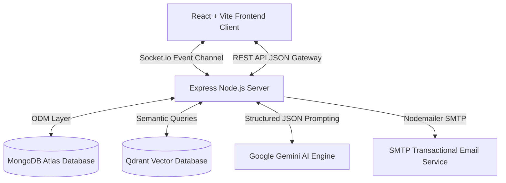

# AI Sales Executive Platform (ASEP)
An industry-grade, autonomous pre-sales qualification agent and real-time CRM monitoring platform designed for Indian IT consultancy markets.

This platform uses an event-driven web-sockets architecture, a custom state-machine orchestrator powered by the Gemini Flash Lite SDK, semantic RAG vector querying, and custom transactional mail dispatches to qualify leads, automate proposals, and schedule callbacks dynamically.

## Live Demo

The redesigned client is deployed on Vercel: [https://client-blue-nu-26.vercel.app](https://client-blue-nu-26.vercel.app)

> The public demo runs without a backend by default. Set `VITE_API_URL` to a deployed API URL to enable live Socket.io conversations, lead qualification, and executive handoff.

---

## 🛠️ Tech Stack & Architecture



### 1. Backend Architecture (Express + TypeScript)
* **Design Pattern: State Machine Orchestrator**
  * The pre-sales conversations follow a state pattern: `GREETING` ➔ `DISCOVERY` ➔ `REQUIREMENT_COLLECTION` ➔ `BRAINSTORMING` ➔ `QUALIFICATION` ➔ `PACKAGE_RECOMMENDATION` ➔ `PROPOSAL_GENERATION` ➔ `HANDOFF` ➔ `CLOSED`.
  * The orchestrator dynamically moves stages as BANT parameters are qualified.
* **Design Pattern: Event Broker Pattern (Sockets)**
  * Uses Socket.io to stream real-time updates (typing indicators, chat takeover signals, notification alerts) across rooms.
* **Design Pattern: Repository Pattern (Mongoose ODM)**
  * Interfaces with Mongoose schemas (`Lead`, `Conversation`, `Message`, `Proposal`, `Meeting`) to ensure transactional consistency across documents.

### 2. Frontend Architecture (React + Vite + Tailwind CSS)
* **Single Page Dashboard & Client Widgets:**
  * **Visitor Chat Widget:** Responsive slide-up drawer showing bot status, interactive suggestion pills, typing dots, and downloadable PDF cards.
  * **Executive CRM Workspace:** A split-screen dashboard displaying a qualified leads pipeline, a live takeover chat console, and a CRM panel with dial/email shortcuts, callback timers, and quick notes.

---

## 💎 Advanced Real-World Features

### 1. 🇮🇳 Local Market Competitive Pricing
* Computes real-time project estimates in Indian Rupees (INR - ₹) based on competitive local consultancy scales.
* Standardized pricing rules:
  * **Web Designing & Development:** Basic Showcase sites range from ₹25,000 to ₹50,000. Professional dynamic apps range from ₹1 Lakh to ₹2.5 Lakhs. Custom SaaS apps range from ₹3 Lakhs to ₹8 Lakhs+.
  * **UI/UX Designing:** Figma wireframes and branding prototypes range from ₹25,000 to ₹1 Lakh.
  * **Mobile Applications:** iOS & Android apps (Flutter/React Native) range from ₹3.5 Lakhs to ₹10 Lakhs.
  * **SEO:** Ranking, backlinks, page-speed check: ₹15,000 to ₹40,000/month.
  * **Content Writing:** High-quality SEO copywriting: ₹10,000 to ₹25,000/month.
  * **Digital Marketing & PPC Ads Shield:** Campaign setup & ad fraud fraud-prevention block shield: ₹25,000 to ₹60,000/month.

### 📅 2. Natural Language Scheduling (NLP Date Parser)
* The agent asks the client for their preferred callback date and time.
* The parser converts natural descriptions (e.g. *"tomorrow at 5 PM"*, *"afternoon"*, *"Monday morning"*) into exact UTC database timestamps.

### 📧 3. Deferred Transactional Emailing
* If the user shares their email address *after* a callback has been scheduled, the backend captures the save event and dispatches the tailored project brief (including their timeline, budget, features, and Meet link) directly to their inbox.

---

## 🚀 Easy Local Setup

We have included an automated setup utility script to prepare your workspace in seconds.

### Prerequisites
* **Node.js:** v18+
* **npm:** v9+
* **MongoDB:** Atlas cloud connection string or local running instance.

### Setup Instructions
1. Clone this repository to your local directory.
2. Grant execution permissions and run the setup script:
   ```bash
   chmod +x setup.sh
   ./setup.sh
   ```
   *This script will verify prerequisites, copy `.env.example` templates, install dependency trees, and pre-compile the server and client builds.*
3. Open `server/.env` and update your `MONGO_URI` and `GEMINI_API_KEY`.
4. Launch the application:
   * **Start Backend API:** `cd server && npm run start`
   * **Start Client Dev:** `cd client && npm run dev`
5. Open **http://localhost:5173** to interact with the platform!
