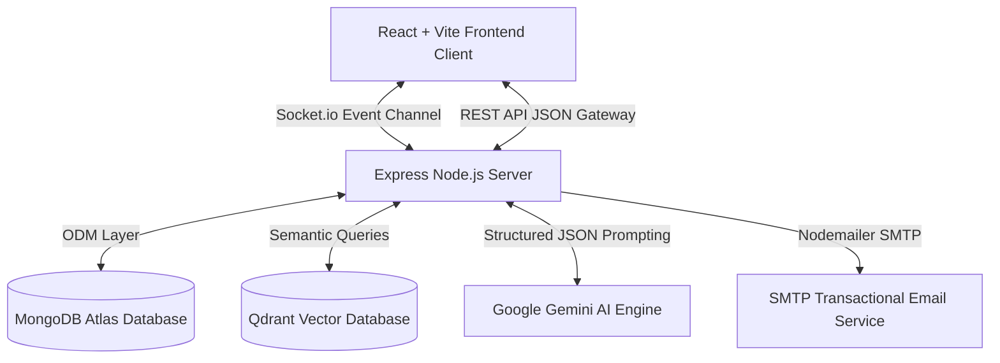

# AI Sales Executive Platform (ASEP)
An industry-grade, autonomous pre-sales qualification agent and real-time CRM monitoring platform designed for Indian IT consultancy markets.

This platform uses an event-driven web-sockets architecture, a custom state-machine orchestrator powered by the Gemini Flash Lite SDK, semantic RAG vector querying, and custom transactional mail dispatches to qualify leads, automate proposals, and schedule callbacks dynamically.

## Live Demo

The redesigned client is deployed on Vercel: [https://client-blue-nu-26.vercel.app](https://client-blue-nu-26.vercel.app)

> The public demo runs without a backend by default. Set `VITE_API_URL` to a deployed API URL to enable live Socket.io conversations, lead qualification, and executive handoff.

---

## 🛠️ Tech Stack & Architecture


```mermaid
graph TD
    Client[React + Vite Frontend Client] <-->|Socket.io Event Channel| Server[Express Node.js Server]
    Client <-->|REST API JSON Gateway| Server
    Server <-->|ODM Layer| Mongo[(MongoDB Atlas Database)]
    Server <-->|Semantic Queries| Qdrant[(Qdrant Vector Database)]
    Server <-->|Structured JSON Prompting| Gemini[Google Gemini AI Engine]
    Server -->|Nodemailer SMTP| SMTP[SMTP Transactional Email Service]
```

### 1. Backend Architecture (Express + TypeScript)
* **Design Pattern: State Machine Orchestrator**
  * The pre-sales conversations follow a state pattern: `GREETING` ➔ `DISCOVERY` ➔ `REQUIREMENT_COLLECTION` ➔ `BRAINSTORMING` ➔ `QUALIFICATION` ➔ `PACKAGE_RECOMMENDATION` ➔ `PROPOSAL_GENERATION` ➔ `HANDOFF` ➔ `CLOSED`.
  * The orchestrator dynamically moves stages as BANT parameters are qualified.
* **Design Pattern: Event Broker Pattern (Sockets)**
  * Uses Socket.io to stream real-time updates (typing indicators, chat takeover signals, notification alerts) across rooms.
* **Design Pattern: Repository Pattern (Mongoose ODM)**
  * Interfaces with Mongoose schemas (`Lead`, `Conversation`, `Message`, `Proposal`, `Meeting`) to ensure transactional consistency across documents.

### 2. Frontend Architecture (React + Vite + Tailwind CSS)
* **Single Page Dashboard & Client Widgets:**
  * **Visitor Chat Widget:** Responsive slide-up drawer showing bot status, interactive suggestion pills, typing dots, and downloadable PDF cards.
  * **Executive CRM Workspace:** A split-screen dashboard displaying a qualified leads pipeline, a live takeover chat console, and a CRM panel with dial/email shortcuts, callback timers, and quick notes.

---

## 💎 Advanced Real-World Features

### 1. 🇮🇳 Local Market Competitive Pricing
* Computes real-time project estimates in Indian Rupees (INR - ₹) based on competitive local consultancy scales.
* Standardized pricing rules:
  * **Web Designing & Development:** Basic Showcase sites range from ₹25,000 to ₹50,000. Professional dynamic apps range from ₹1 Lakh to ₹2.5 Lakhs. Custom SaaS apps range from ₹3 Lakhs to ₹8 Lakhs+.
  * **UI/UX Designing:** Figma wireframes and branding prototypes range from ₹25,000 to ₹1 Lakh.
  * **Mobile Applications:** iOS & Android apps (Flutter/React Native) range from ₹3.5 Lakhs to ₹10 Lakhs.
  * **SEO:** Ranking, backlinks, page-speed check: ₹15,000 to ₹40,000/month.
  * **Content Writing:** High-quality SEO copywriting: ₹10,000 to ₹25,000/month.
  * **Digital Marketing & PPC Ads Shield:** Campaign setup & ad fraud fraud-prevention block shield: ₹25,000 to ₹60,000/month.

### 📅 2. Natural Language Scheduling (NLP Date Parser)
* The agent asks the client for their preferred callback date and time.
* The parser converts natural descriptions (e.g. *"tomorrow at 5 PM"*, *"afternoon"*, *"Monday morning"*) into exact UTC database timestamps.

### 📧 3. Deferred Transactional Emailing
* If the user shares their email address *after* a callback has been scheduled, the backend captures the save event and dispatches the tailored project brief (including their timeline, budget, features, and Meet link) directly to their inbox.

### 💹 4. Adaptive Market Pricing
* Pricing lives as **versioned data**, not code: a `PricingConfig` rate card that the AI reads fresh on every conversation, so quotes always use the *current* ranges.
* A daily background job re-tunes each service's price multiplier within a bounded corridor (±30% by default) based on:
  * **Win/loss feedback** — proposal outcomes recorded via `PATCH /api/v1/proposals/:id/status` (win rate > 60% nudges prices up, < 35% nudges them down, minimum 5 samples per service).
  * **Competitor position** — `CompetitorPrice` records; prices ease down when we sit well above the market median and may rise when below.
  * **Demand trend** — qualified-lead volume over the last 7 days vs. the previous 7.
* Every proposal records which pricing version generated it (`pricingVersion` + matched `services`) so the feedback loop can attribute outcomes to price points. Stale SENT proposals auto-expire after 30 days.
* **Updating over time:** the job runs at boot and then every `PRICING_REFRESH_HOURS` (default 24h). Record competitor observations via `POST /api/v1/competitors` (`{ service, competitor, price }`), inspect the live rate card via `GET /api/v1/pricing/rates`, and trigger an immediate re-tune via `POST /api/v1/pricing/recompute`. Proposal decisions (`PATCH /api/v1/proposals/:id/status`) also trigger a recompute on the spot.
* **Automatic market capture:** a market scanner periodically fetches configured competitor pricing pages (`MarketTarget` records, managed via `/api/v1/market-targets`) and extracts INR rates — JSON-LD structured data first, plain `₹` amounts as fallback. Observations land in `CompetitorPrice` and feed the next re-tune. Run it on demand with `POST /api/v1/market-targets/scan`; the check interval is `MARKET_SCAN_HOURS` (default 24h) and each target has its own refresh window (`intervalHours`, default weekly).

---

## 🚀 Easy Local Setup

We have included an automated setup utility script to prepare your workspace in seconds.

### Prerequisites
* **Node.js:** v18+
* **npm:** v9+
* **MongoDB:** Atlas cloud connection string or local running instance.

### Setup Instructions
1. Clone this repository to your local directory.
2. Grant execution permissions and run the setup script:
   ```bash
   chmod +x setup.sh
   ./setup.sh
   ```
   *This script will verify prerequisites, copy `.env.example` templates, install dependency trees, and pre-compile the server and client builds.*
3. Open `server/.env` and update your `MONGO_URI`, `GEMINI_API_KEY`, and `JWT_SECRET` (the server refuses to boot with the placeholder secret). For production, also set `PUBLIC_BASE_URL` to your deployed API URL so proposal PDF links work.
4. Launch the application:
   * **Start Backend API:** `cd server && npm run start`
   * **Start Client Dev:** `cd client && npm run dev`
5. Open **http://localhost:5173** to interact with the platform!

## ☁️ Deployment (free tier, judge-demo ready)

The recommended free setup keeps the whole product alive reliably: **Vercel** for the
client, **Koyeb** for the long-running server (WebSockets + scheduled pricing/market
jobs need a real process, not serverless), and **MongoDB Atlas** free tier for data.
Qdrant is optional — the RAG layer falls back to built-in chunks when it is offline.

### 1. Server → Koyeb (`koyeb.yaml` at repo root)
1. Sign up at koyeb.com (GitHub login works).
2. Import the repo **dgexplores/smart-chatbot** → it picks up `koyeb.yaml`
   (builds `server/Dockerfile`, runs on port 5001, health-checked at `/health`).
3. Set service variables (secrets are never committed):
   - `JWT_SECRET` (required — generate with `openssl rand -hex 32`)
   - `MONGO_URI` from your Atlas cluster
   - `PUBLIC_BASE_URL` = the Koyeb service URL (makes proposal PDF links work)
   - `CLIENT_URL` = the Vercel URL below (CORS)
   - `MOCK_LLM=false` + `GEMINI_API_KEY` for real AI (free key at aistudio.google.com)
4. `SEED_DEMO_DATA=true` is set in `koyeb.yaml` — on first boot it seeds 10 realistic
   leads, conversations, proposals (with win/loss outcomes), meetings, and 8 weeks of
   competitor market observations so the dashboard looks alive for a showcase.

### 2. Client → Vercel
1. `vercel login`, then from `client/`: `vercel --prod` (uses `client/vercel.json`).
2. Set `VITE_API_URL` to the Koyeb service URL in the project settings and rebuild.

### 3. Verify
- `GET https://<server>/health` → `{ status: 'ok' }`
- `GET https://<server>/api/v1/pricing/rates` → live rate card with multipliers
- Open the Vercel URL → chat widget talks to the real backend via WebSockets.

### Alternative hosts
- **Railway** (`scripts/deploy-railway.sh` — one-command deploy): note the free plan
  can hit the resource-provision limit; Hobby ($5/mo) is required for more services.
- **Docker anywhere**: `server/Dockerfile` builds the API for any container host.
- **Render/Fly**: same Dockerfile; expect free-tier sleep/cold-start behaviour.
